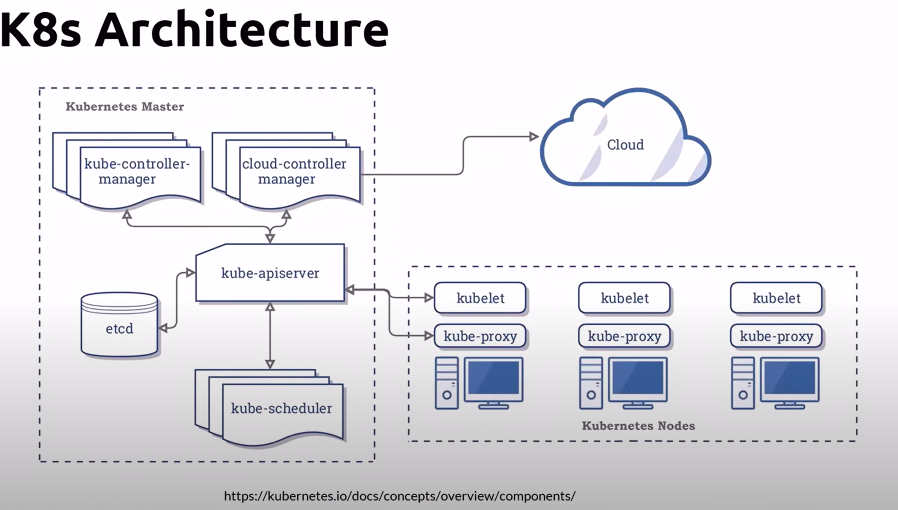
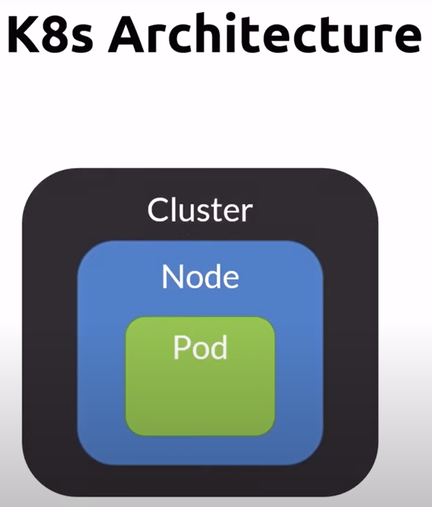

### Basic terminoligies (src - github copilot)

In Kubernetes, understanding the relationships between namespaces, contexts, clusters, pods, and nodes is crucial for managing and organizing your resources effectively. Here's a detailed breakdown:

1. **Cluster**:

   - A cluster is a collection of nodes (machines) that run containerized applications managed by Kubernetes. It includes a(viz. one) control plane (API server, scheduler, etc.) and can have multiple worker nodes where applications run.

2. **Node**:

   - A node is a single machine (virtual or physical) in a Kubernetes cluster. Each node runs pods and is managed by the control plane. Nodes can be worker nodes or master nodes (control plane components). Nodes can have multiple pods running on them.

3. **Pod**:

   - A pod is the smallest deployable unit in Kubernetes. It represents a single instance of a running process in your cluster. Pods can contain one or more containers that are tightly coupled and share the same network namespace and storage.

4. **Namespace**:

   - Namespaces are virtual clusters within a physical cluster. They provide a way to divide cluster resources between multiple users or teams. Each namespace is isolated from others, allowing for resource management and access control.

5. **Context**:
   - A context in Kubernetes is a configuration that combines a cluster, a user, and a namespace. It allows you to switch between different clusters and namespaces easily. Contexts are defined in the kubeconfig file.
     In Kubernetes, nodes and pods have a fundamental relationship:

### Relationship:

- **Cluster**: The overall infrastructure that includes nodes.
- **Node**: Individual machines within a cluster.
- **Pod**: The smallest unit of deployment, running on nodes.
- **Namespace**: Logical partitions within a cluster to isolate resources.
- **Context**: Configuration that specifies which cluster, user, and namespace to use.

Here's a visual representation:

```
Cluster
|__Master Node(Control Plane)
|
├── (Worker) Node1
│   ├── Namespace1
│   │   ├── Pod1
│   │   └── Pod2
│   └── Namespace2
│       ├── Pod3
│       └── Pod4
├── (Worker) Node2
│   ├── Namespace1
│   │   ├── Pod5
│   │   └── Pod6
│   └── Namespace3
│       ├── Pod7
│       └── Pod8
```

And a context example in the kubeconfig file:

```yaml
contexts:
  - name: my-context
    context:
      cluster: my-cluster
      user: my-user
      namespace: my-namespace
```

Each context represents a cluster and a user.
This setup allows you to manage different environments (e.g., development, staging, production) and teams efficiently.

### Architecture Diagram

A Kubernetes cluster consists of a master node and multiple worker nodes.

### Definitions

Kubernetes master node (aka. Control plane) - runs the kubernetes services and controllers.

Worker nodes - runs the containers that we deploy in the cluster


### Relationship - Node and pods:

Pods run on nodes: Each pod is scheduled to run on a node. The Kubernetes control plane automatically handles the scheduling of pods to nodes based on resource availability and other constraints.
Nodes provide resources to pods: Nodes provide the CPU, memory, and storage resources that pods need to run. The kubelet, an agent running on each node, ensures that the containers in the pod are running and healthy.

Container runs in a pod, pod runs in a node and multiple nodes forms a cluster

