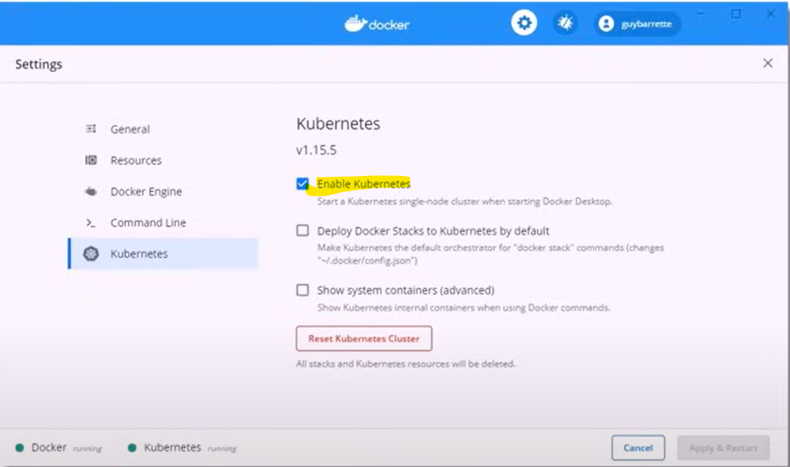

# L17-02

Let’s test our local Kubernetes installation.

    kubectl cluster-info

In this lab, we have used Kubernetes extension provided by Docker Desktop.

The Kubernetes installation that comes with Docker Desktop is limited to a single-node cluster12. This means you can only run one Kubernetes cluster at a time, and it will be a single-node cluster, which includes both the master and worker nodes on the same node1.

If you need to work with multiple clusters or a more complex setup, you might want to consider using Minikube or other tools like Kind (Kubernetes in Docker) that allow for more flexibility and customization.
