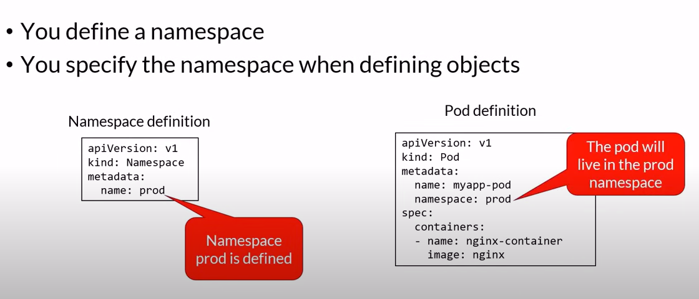
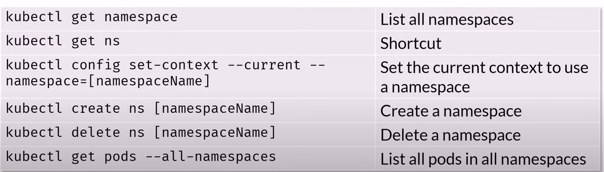

## Definition

A namespace is a group of resources in a kubernetes cluster. It logically groups resources(like pods, etc). Each resource in a namespace is known as an object. All the objects in the namespace will get deleted when the namespace is deleted.

Application of namespaces:- if you want to apply same specifications to a group of resources, then simply put all those resources in a namespace and then add the specification to the namespace instead of every individual resource.

## kubectl-namespace cheat sheet

