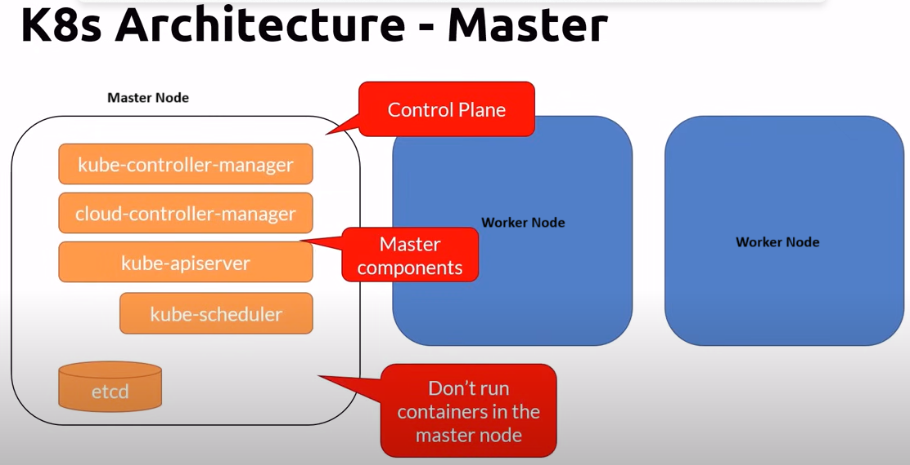

# Master Node details:

The etcd is a datastore(key-value pair) that maintains the state of a kub-cluster. Its the single source of truth in a kubernetes cluster.
The kub-apiserver is the only component communicating with etcd.

### kube-apiserver

1.  REST interface
2.  Saves state to the datastore(etcd)
3.  All clients (eg:- kubectl - the command line client for kubernetes) interact with it and never directly to the datastore.

### etcd

1. Acts as the cluster datastore for storing the state
2. key-value store
3. Not a database or a datastore for applications to use
4. The single source of truth in a cluster.

### kube-ontroller-manager

1. The controller of controllers!
2. It runs contrillers
   1. Node controller
   2. Replication controller
   3. Endpoints controller
   4. Service account and Token controllers

### cloud-controller-manager

1. Interact with cloud providers(viz. AKS/GKS/Amazon-Kube) controllers.
   1. Node: for checking the cloud provider to determine if node has been delted in the cloud after it stops responding.
   2. Route-traffic: for setting up routes in the underlying cloud infrastrucuture.
   3. Service: for creating, updating and deleting cloud provider load balancers.
   4. Volume: for creating, attaching, and mounting volumes and interacting with the cloud provider to orchestrate the volume.

### kube-scheduler

1.  Watches newly created pods that have no node assigned and slects a node for them to run on
2.  Factors taken in to account for sheduling decisions include:-
    1. Individual and collective resource requirements
    2. Hardware/software/policy constraints.
    3. Affinity and anti-affinity specifications
    4. Data-locality

### Add-ons

You can install various add-ons on the master node. These add-ons provide additional functionality to the kubernetes cluster.
eg:- of add-ons: DNS, WEB UI(dahsboard), cluster-level logging, container resource monitoring.
