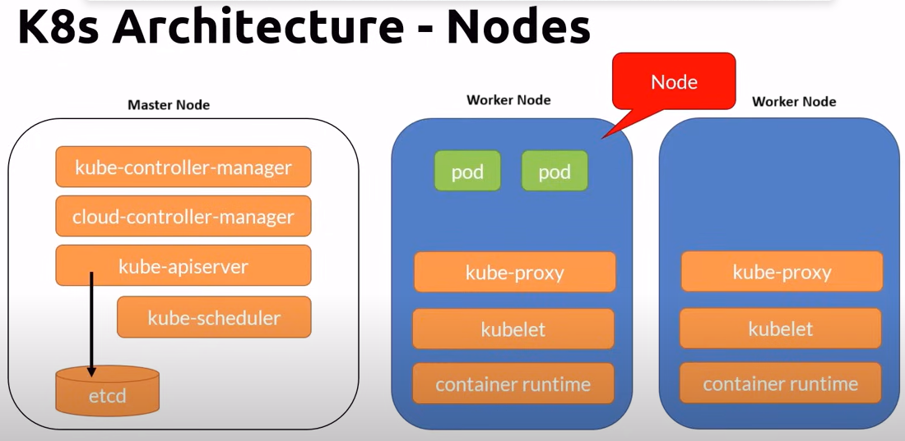
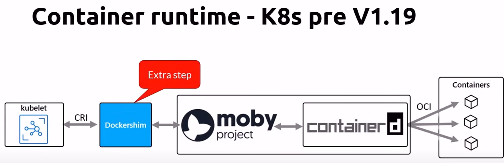
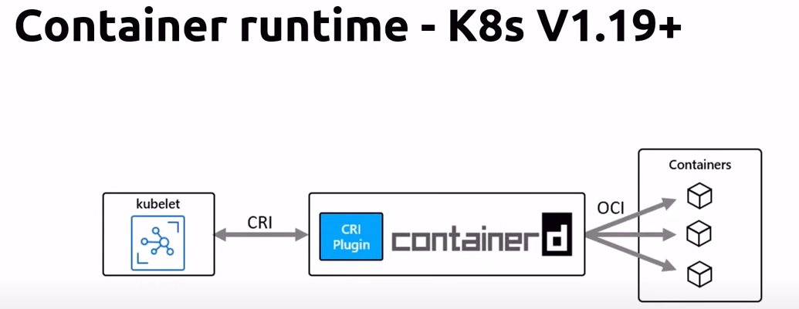

# Worker Node details

When a worker node is created/added to a cluster, by default, following kubernetes services are installed automatically on the worker node. These services are necessary to run pods on the worker node and are managed by master components(which run on the master nodes)

## kubelet

1. Manage the pods lifecycle
2. Ensures that the containers described in the Pod specs are running and healthy.

## kube-proxy

1. A network proxy
2. Manages network rules on nodes. All the traffic on the node will have to go through kube-proxy.

## Container runtime

Kubernetes supports several container runtimes. A container runtime implements the Kubernetes Container Runtime interface. Supported container runtimes - Moby, Container-d,Cri-o, Rkt, Kata, Virtlet.

 

### So what has changed since K8s v1.19+ ?

Docker images continue to run as it is. But you can no longer access the docker engine inside the cluster directly. Docker commands wont run if you try to run them from ssh(command shell) of a node. In order to run docker commands inside a worker node, you need to use a tool "crictl" instead.

## Node Pool

1. A node pool is a group of vistual machines, all with the same size.
2. A cluster can have multiple node pools - each of these pools can host different sizes of vms. each pool can be autoscaled differently from the other pools.
3. Note: Docker desktop cluster (used in demo labs of this course) is limited to 1 node.
