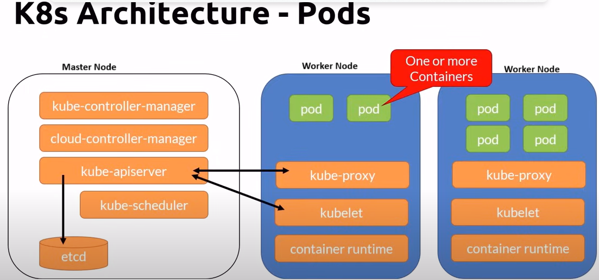
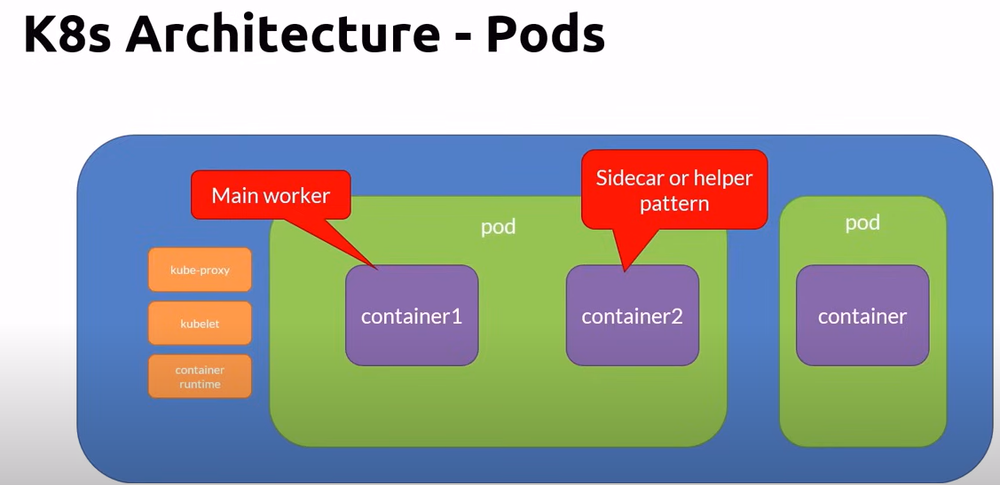
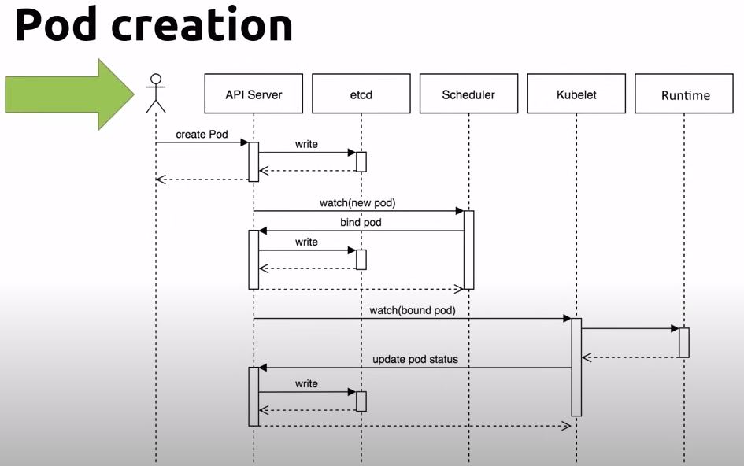
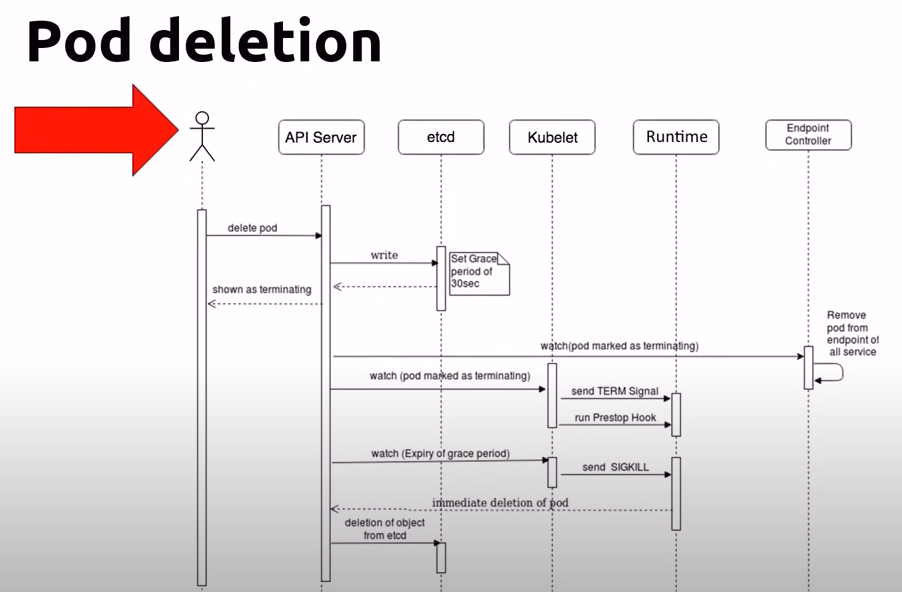
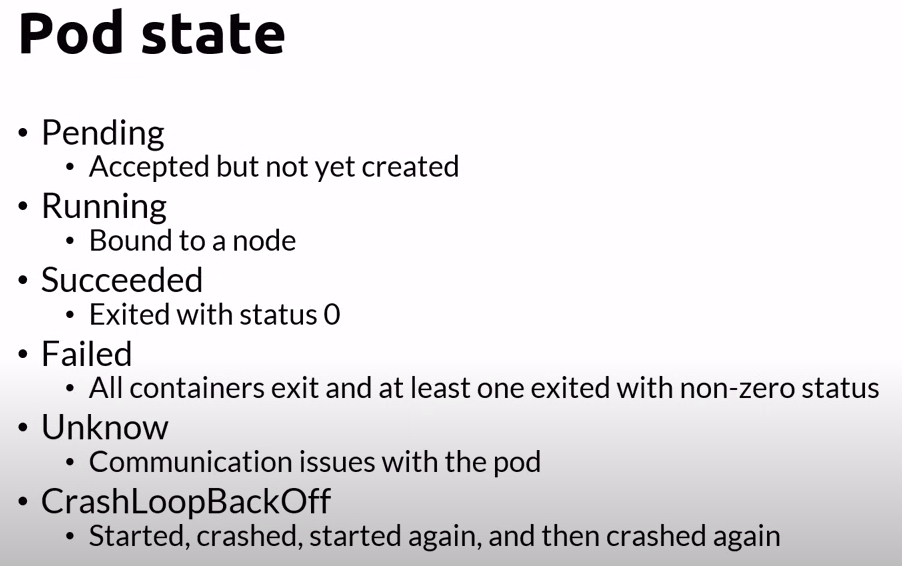

# Pods

1. Pod is a atomic unit of the smallest unit of work of Kubernetes(K8s)
2. It encapsulates an applications container.
3. Represents a unit of deployment
4. _Pods can run one or multiple containers_
5. Container within a pod share - IP address space, mounted volumes
6. Containers within a pod can communicate via - localhost, IPC
7. Pods are ephemeral viz. designed to be temporary and short-lived. Pods are often used to run stateless applications, where the state is not stored within the pod itself but in external storage systems. This allows pods to be easily replaced without losing data.
8. Deploying a pod is an atomic operation - it succeeds or fails
9. If pod fails, its not repaired, its always replaced with a new one with a shiny new IP address
10. You don't update a pod, you replace it with an updated version.
11. You scale by adding more pods, not more containers in a pod.
12. _Multi-container pods are supported, but ideally, multiple containers should use the same pod only if one of the containers runs a main process and the other container runs a supporting process which is tightly coupled with the main process._

## Pod Lifecycle

### Create Pod

A user runs a kubectl command "to Create Pod" which in turn calls the API server.
API server(ie. kube-apiserver on master node) writes request to create pod to etcd as it maintains the state of cluster. Scheduler keeps an eye on newly created pods and attaches/binds the pod to a node. Kubelet running on the node will watch out for the pod(bound to its node) and issue a command to create an instance of container inside the pod.

### Delete Pod

### Pod states

