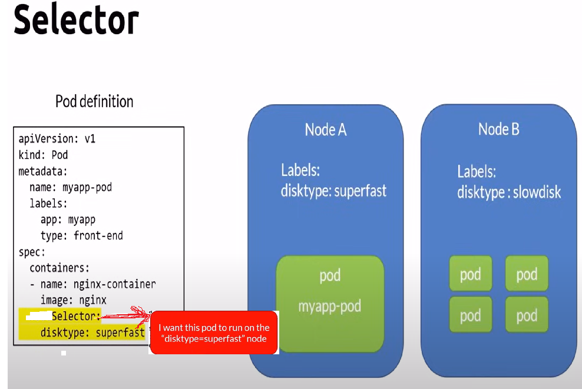

# Selectors

Labels(in .yaml files):- are key-value pairs used to identify, describe and group related sets of objects or resources.
eg:- 

_Selectors use labels to filter or select objects_

## Types of Selectors (src = copilot)

n Kubernetes, selectors are used to identify a set of objects. There are two main types of selectors:

Label Selectors: These are the most common type and are used to select resources based on labels. Labels are key-value pairs attached to objects, such as pods. There are two types of label selectors:

Equality-based Selectors: These allow you to filter resources based on equality (e.g., key=value) or inequality (e.g., key!=value).
Set-based Selectors: These allow you to filter resources based on a set of values (e.g., key in (value1, value2) or key notin (value1, value2)).
Field Selectors: These are used to select resources based on the value of one or more resource fields. For example, you can use field selectors to filter pods based on their status or metadata (e.g., metadata.name=my-pod or status.phase=Running).
